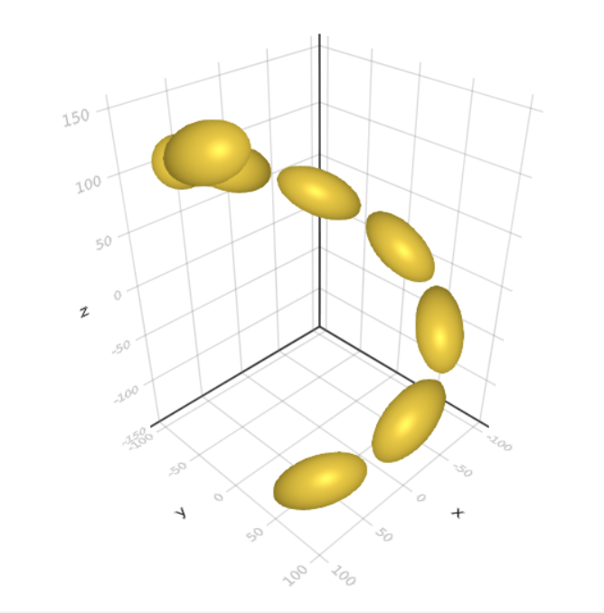

# Visualisation of cluster geometries

Static 3D visualisations can be shown with a simple wrapper around `Makie.meshscatter`.

```@docs
visualise_makie
```


```@example 1
using CoupledDipole
using Makie 
Makie.inline!(true)

cl = cluster_helix(8, 20, 20, 40, 100, 300, π/4, 0, "right")
visualise_makie(cl, colour = :gold)
```



We're hoping to use `three.js` to provide interactive 3D visualisations of the cluster geometries, but at present this functionality is not integrated with the Documentation or with the IDE. A basic wrapper is provided to generate self-contained `html` pages that can be viewed in a web browser.


```@docs
visualise_threejs
```


```@raw html

<script type="module">

  import * as THREE from 'https://cdn.skypack.dev/three';

import  { TrackballControls }  from 'https://cdn.skypack.dev/three-trackballcontrols';

</script>


<div id="webgl"></div>


<script>
(function () {

var webglEl = document.getElementById('webgl');

if (!Detector.webgl) {
   Detector.addGetWebGLMessage(webglEl);
   return;
}

var width  = 600,
   height = 600;

// sphere params
var radius   = 1,
   segments = 36,
   rotation = 6;

var scene = new THREE.Scene();
scene.background = new THREE.Color( 0xeeeeee );


var camera = new THREE.PerspectiveCamera(100, width / height, 0.01, 1000);

camera.position.z = 200;

var renderer = new THREE.WebGLRenderer();
renderer.setSize(width, height);

const frontSpot = new THREE.SpotLight(0xeeeece);
frontSpot.position.set(1000, 1000, 1000);
scene.add(frontSpot);

const frontSpot2 = new THREE.SpotLight(0xddddce);
frontSpot2.position.set(-500, -500, -500);
scene.add(frontSpot2);


scene.add(new THREE.AmbientLight(0xffffff, 1));

   var xDistance = 2;
    var yDistance = 2;
      //initial offset so does not start in middle.
      var xOffset = 0;
      var yOffset = 1;
      var sphere1 = createSphere(radius, segments);
                sphere1.position.x = 35.35533905932738;
                sphere1.position.y = 35.35533905932737;
                sphere1.position.z = 99.99999999999999;
                sphere1.scale.set(10,10,20);
                sphere1.rotation.z = 3.9269908169872414;
                sphere1.rotation.x = 2.137707831735906;
                sphere1.rotation.y = 0.0;
                sphere1.rotation.order = 'ZXY';
                scene.add(sphere1);
var sphere2 = createSphere(radius, segments);
                sphere2.position.x = 3.061616997868383e-15;
                sphere2.position.y = 50.0;
                sphere2.position.z = 74.99999999999999;
                sphere2.scale.set(10,10,20);
                sphere2.rotation.z = 4.71238898038469;
                sphere2.rotation.x = 2.137707831735906;
                sphere2.rotation.y = 0.0;
                sphere2.rotation.order = 'ZXY';
                scene.add(sphere2);
var sphere3 = createSphere(radius, segments);
                sphere3.position.x = -35.35533905932737;
                sphere3.position.y = 35.35533905932738;
                sphere3.position.z = 49.999999999999986;
                sphere3.scale.set(10,10,20);
                sphere3.rotation.z = -0.7853981633974483;
                sphere3.rotation.x = 2.137707831735906;
                sphere3.rotation.y = 0.0;
                sphere3.rotation.order = 'ZXY';
                scene.add(sphere3);
var sphere4 = createSphere(radius, segments);
                sphere4.position.x = -50.0;
                sphere4.position.y = 6.123233995736766e-15;
                sphere4.position.z = 24.999999999999986;
                sphere4.scale.set(10,10,20);
                sphere4.rotation.z = -2.220446049250313e-16;
                sphere4.rotation.x = 2.137707831735906;
                sphere4.rotation.y = 0.0;
                sphere4.rotation.order = 'ZXY';
                scene.add(sphere4);
var sphere5 = createSphere(radius, segments);
                sphere5.position.x = -35.355339059327385;
                sphere5.position.y = -35.35533905932737;
                sphere5.position.z = 0.0;
                sphere5.scale.set(10,10,20);
                sphere5.rotation.z = 0.7853981633974481;
                sphere5.rotation.x = 2.137707831735906;
                sphere5.rotation.y = 0.0;
                sphere5.rotation.order = 'ZXY';
                scene.add(sphere5);
var sphere6 = createSphere(radius, segments);
                sphere6.position.x = -9.184850993605149e-15;
                sphere6.position.y = -50.0;
                sphere6.position.z = -25.000000000000014;
                sphere6.scale.set(10,10,20);
                sphere6.rotation.z = 1.5707963267948963;
                sphere6.rotation.x = 2.137707831735906;
                sphere6.rotation.y = 0.0;
                sphere6.rotation.order = 'ZXY';
                scene.add(sphere6);
var sphere7 = createSphere(radius, segments);
                sphere7.position.x = 35.35533905932737;
                sphere7.position.y = -35.355339059327385;
                sphere7.position.z = -49.999999999999986;
                sphere7.scale.set(10,10,20);
                sphere7.rotation.z = 2.356194490192345;
                sphere7.rotation.x = 2.137707831735906;
                sphere7.rotation.y = 0.0;
                sphere7.rotation.order = 'ZXY';
                scene.add(sphere7);
var sphere8 = createSphere(radius, segments);
                sphere8.position.x = 50.0;
                sphere8.position.y = -1.2246467991473532e-14;
                sphere8.position.z = -75.00000000000001;
                sphere8.scale.set(10,10,20);
                sphere8.rotation.z = 3.141592653589793;
                sphere8.rotation.x = 2.137707831735906;
                sphere8.rotation.y = 0.0;
                sphere8.rotation.order = 'ZXY';
                scene.add(sphere8);
var sphere9 = createSphere(radius, segments);
                sphere9.position.x = 35.355339059327385;
                sphere9.position.y = 35.35533905932737;
                sphere9.position.z = -100.00000000000001;
                sphere9.scale.set(10,10,20);
                sphere9.rotation.z = 3.9269908169872414;
                sphere9.rotation.x = 2.137707831735906;
                sphere9.rotation.y = 0.0;
                sphere9.rotation.order = 'ZXY';
                scene.add(sphere9);
var sphere10 = createSphere(radius, segments);
                sphere10.position.x = 1.5308084989341916e-14;
                sphere10.position.y = 50.0;
                sphere10.position.z = -124.99999999999999;
                sphere10.scale.set(10,10,20);
                sphere10.rotation.z = 4.71238898038469;
                sphere10.rotation.x = 2.137707831735906;
                sphere10.rotation.y = 0.0;
                sphere10.rotation.order = 'ZXY';
                scene.add(sphere10);


//var axesHelper = new THREE.AxesHelper( 5 );
//scene.add( axesHelper );

         scene.add( new THREE.AxesHelper( 1 ) );
var controls = new THREE.TrackballControls(camera);

webglEl.appendChild(renderer.domElement);

render();

function render() {
   controls.update();
   requestAnimationFrame(render);
   renderer.render(scene, camera);
}


function createSphere(radius, segments) {
// material = new THREE.MeshBasicMaterial( {color: 0xffff00} );
//	 const material = new THREE.MeshLambertMaterial({
//  color: 0xdaa520,
//  emissive: 0x111111,
//});
const material = new THREE.MeshStandardMaterial({
color: 0xfcc742,
emissive: 0x111111,
specular: 0xffffff,
metalness: 0.8,
roughness: 0.6,
});
   return new THREE.Mesh(
      new THREE.SphereGeometry(radius, segments, segments),
      material
   );
}


}());
</script>
```
